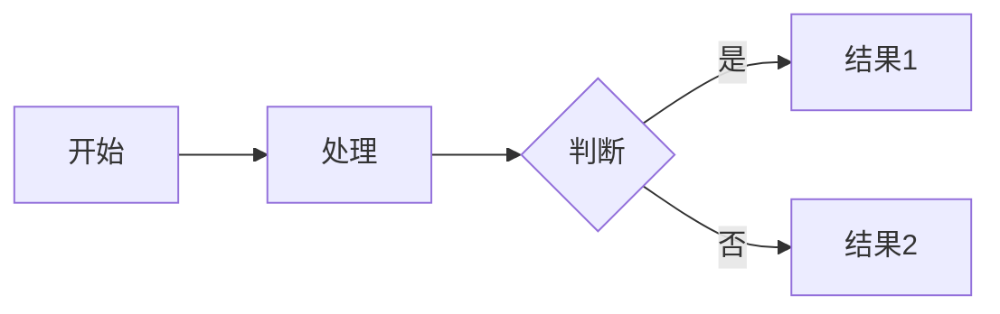

# 学习材料内容填充指南

本指南说明如何为每个主题填充具体内容。

## 内容标准

### 理论指南（theory/guide.md）

#### 字数要求
- **最少**: 3,000 字
- **推荐**: 4,000 - 5,000 字
- **最多**: 8,000 字（复杂主题可以更长）

#### 结构要求

```markdown
# [主题标题] 详解

> 简短的引言，说明本主题的重要性和学习价值

## 目录

1. [基础概念](#1-基础概念)
2. [OpenClaw 实战](#2-openclaw-实战)
3. [最佳实践](#3-最佳实践)
4. [常见陷阱](#4-常见陷阱)
5. [进阶练习](#5-进阶练习)

---

## 1. 基础概念

### 1.1 什么是 X？

解释核心概念，包括：
- 定义
- 为什么需要
- 适用场景

### 1.2 基础示例

最简单的代码示例，注释详细

### 1.3 OpenClaw 中的应用

简要说明 OpenClaw 如何使用这个技术

---

## 2. OpenClaw 实战

### 2.1 真实用例 1

从 OpenClaw 提取代码，详细解释

### 2.2 真实用例 2

另一个例子，展示不同的应用场景

### 2.3 设计要点

总结 OpenClaw 代码中的设计亮点

---

## 3. 最佳实践

### 3.1 何时使用

列出推荐使用的场景

### 3.2 如何使用

Step-by-step 指南

### 3.3 注意事项

需要特别注意的点

---

## 4. 常见陷阱

### 4.1 错误 1：[描述]

```typescript
// ❌ 错误示例
// 解释为什么错误

// ✅ 正确示例
// 解释正确做法
```

### 4.2 错误 2：[描述]

同上格式

---

## 5. 进阶练习

### 练习 1

简短的编程挑战

### 练习 2

另一个挑战

---

## 参考资源

- [官方文档链接]
- [OpenClaw 源码路径]
- [推荐阅读]
```

### OpenClaw 代码示例

#### 文件组织

在 `examples/openclaw/` 目录创建：

```
openclaw/
├── README.md           # 总体说明
├── 01-example.ts       # 提取的代码片段 1
├── 02-example.ts       # 提取的代码片段 2
├── 03-example.ts       # 提取的代码片段 3
└── annotations/        # 详细注解文件
    ├── 01-annotations.md
    ├── 02-annotations.md
    └── 03-annotations.md
```

#### 代码提取原则

1. **保持完整性**：代码片段应该能独立理解
2. **添加注释**：为关键行添加详细中文注释
3. **突出重点**：使用 `// 👉` 或 `// ⚠️` 标记重点
4. **保留上下文**：包含必要的类型定义和导入

#### 示例格式

```typescript
// 01-plugin-loader.ts
// 提取自: src/plugins/loader.ts
// 功能: 演示插件的动态加载机制

import type { OpenClawPluginDefinition } from "./types.js";

// 👉 使用 Proxy 实现懒加载
export function createLazyPluginRuntime<T extends OpenClawPluginDefinition>(
  plugin: T
): LazyPluginRuntime<T> {
  let runtime: PluginRuntime | null = null;
  
  // Proxy 拦截属性访问
  return new Proxy({} as PluginRuntime, {
    get(target, prop) {
      // ⚠️ 首次访问时才初始化
      if (!runtime) {
        runtime = initializePluginRuntime(plugin);
      }
      return runtime[prop as keyof PluginRuntime];
    },
  });
}

// 关键点：
// 1. 使用 Proxy 延迟初始化
// 2. 泛型保留插件类型信息
// 3. 首次访问触发实际加载
```

### 简化示例

#### 文件组织

在 `examples/simplified/` 目录创建：

```
simplified/
├── README.md              # 学习路径说明
├── 01-basic.ts            # 最简单的示例
├── 02-intermediate.ts     # 中等复杂度
├── 03-advanced.ts         # 接近真实场景
└── 04-complete.ts         # 完整实现
```

#### 渐进式设计

每个文件应该比前一个稍微复杂一点：

**01-basic.ts**
```typescript
// 最简单的版本，只包含核心概念
// 目标：让初学者理解基本原理

// 简单的插件定义
type Plugin = {
  name: string;
  execute: () => void;
};

// 简单的注册表
const plugins = new Map<string, Plugin>();

function register(plugin: Plugin) {
  plugins.set(plugin.name, plugin);
}
```

**02-intermediate.ts**
```typescript
// 添加一些实用功能
// 目标：展示如何扩展基础系统

// 添加类型安全
type Plugin<T = unknown> = {
  name: string;
  config?: T;
  execute: (config: T) => void;
};

// 添加泛型支持
class PluginRegistry {
  private plugins = new Map<string, Plugin>();
  
  register<T>(plugin: Plugin<T>): void {
    this.plugins.set(plugin.name, plugin);
  }
}
```

**03-advanced.ts**
```typescript
// 接近生产级别的实现
// 目标：展示真实系统的考虑因素

// 添加生命周期、错误处理等
```

**04-complete.ts**
```typescript
// 完整的可用实现
// 目标：可以直接在项目中使用
```

### 练习题

#### 文件：exercises/problems.md

```markdown
# [主题] - 练习题

## 练习 1：[标题]

### 难度：⭐（简单）

### 要求

明确的功能需求，3-5 点

### 代码模板

```typescript
// TODO: 实现功能
```

### 测试用例

```typescript
// 预期行为
```

### 提示

- 提示 1
- 提示 2

### 时间估算

约 15-20 分钟

---

## 练习 2：[标题]

### 难度：⭐⭐（中等）

（同上格式）

---

## 练习 3：[标题]

### 难度：⭐⭐⭐（困难）

（同上格式）
```

#### 参考答案：exercises/solutions/

每道题的答案在独立文件中：

```
solutions/
├── problem-01.ts
├── problem-02.ts
├── problem-03.ts
├── problem-04.ts
└── problem-05.ts
```

每个答案文件包含：
1. 完整的实现代码
2. 详细的注释说明
3. 时间复杂度/空间复杂度分析（如适用）
4. 扩展思考题

### 实战项目

#### 文件：projects/requirements.md

```markdown
# 项目：[项目名称]

## 项目概述

### 学习目标

列出 3-5 个具体的学习目标

### 预估时间

- **总计**: X-Y 小时
- **理解需求**: XX 分钟
- **实现核心功能**: XX 小时
- **测试和优化**: XX 分钟

---

## 功能需求

### 核心功能

1. 功能 1
   - 详细描述
   - 技术要点

2. 功能 2
   - 详细描述
   - 技术要点

### 扩展功能（可选）

1. 扩展 1
2. 扩展 2

---

## 技术要求

### 必须使用的技术

- 技术 1：用于 XXX
- 技术 2：用于 XXX

### 类型定义要求

```typescript
// 核心类型定义
```

---

## 实现步骤

### 第 1 步：[步骤名称]（XX 分钟）

详细描述

```typescript
// 代码框架
```

### 第 2 步：[步骤名称]（XX 分钟）

详细描述

---

## 测试用例

### 测试 1：[场景]

```typescript
// 测试代码
```

### 测试 2：[场景]

```typescript
// 测试代码
```

---

## 评分标准

- **类型安全性** (30%)
- **功能完整性** (30%)
- **代码质量** (25%)
- **扩展性** (15%)

---

## 提交要求

- [ ] 所有代码通过 TypeScript 编译
- [ ] 所有测试用例通过
- [ ] 添加 README.md
- [ ] 代码有注释

---

## 参考资源

- [OpenClaw 相关代码]
- [相关文档]
```

#### Starter 代码：projects/starter/

提供项目的起始代码：

```
starter/
├── package.json        # 依赖配置
├── tsconfig.json       # TypeScript 配置
├── src/
│   ├── types.ts       # 类型定义框架
│   ├── index.ts       # 主文件框架
│   └── utils.ts       # 工具函数框架
└── README.md          # 快速开始指南
```

#### 测试用例：projects/tests/

```
tests/
├── basic.test.ts      # 基础功能测试
├── advanced.test.ts   # 高级功能测试
└── integration.test.ts # 集成测试
```

---

## 内容填充工作流

### 1. 研究阶段（1-2 小时）

1. **阅读 OpenClaw 源码**
   - 找到所有相关文件
   - 理解实现原理
   - 记录关键代码片段

2. **研究相关资料**
   - 官方文档
   - 最佳实践文章
   - 相关博客和教程

3. **制定大纲**
   - 确定要讲解的要点
   - 规划代码示例
   - 设计练习题思路

### 2. 编写阶段（3-4 小时）

1. **编写理论指南**（90 分钟）
   - 按照模板结构编写
   - 包含足够的代码示例
   - 确保概念解释清晰

2. **提取 OpenClaw 示例**（60 分钟）
   - 选择 3-5 个代码片段
   - 添加详细注释
   - 编写注解文档

3. **创建简化示例**（60 分钟）
   - 从简单到复杂
   - 每个示例可独立运行
   - 注释清晰

4. **编写练习题**（30 分钟）
   - 5 道题，难度递增
   - 提供代码模板
   - 编写参考答案

5. **设计实战项目**（30 分钟）
   - 明确需求
   - 提供 starter 代码
   - 编写测试用例

### 3. 审查阶段（30-60 分钟）

1. **自我审查**
   - 检查错别字
   - 验证代码能运行
   - 确保链接有效

2. **测试代码**
   - 所有示例编译通过
   - 练习题答案正确
   - 项目 starter 可用

3. **优化完善**
   - 添加图表（如需要）
   - 补充参考资源
   - 改进可读性

---

## 工具和资源

### TypeScript Playground

用于测试类型示例：https://www.typescriptlang.org/play

### Mermaid 图表

用于创建流程图和架构图：

```markdown

```

### 代码格式化

使用 OpenClaw 的格式化工具：

```bash
pnpm format:fix learn/
```

---

## 质量检查清单

完成一个主题后，使用此清单检查：

### 理论指南
- [ ] 字数达到 3000+
- [ ] 包含至少 5 个代码示例
- [ ] 有清晰的章节结构
- [ ] 解释了"为什么"而不只是"是什么"
- [ ] 包含常见错误和最佳实践

### 代码示例
- [ ] OpenClaw 示例有 3-5 个
- [ ] 简化示例有渐进式 4 个版本
- [ ] 所有代码都能编译
- [ ] 注释详细且准确
- [ ] 代码风格一致

### 练习题
- [ ] 有 5 道题
- [ ] 难度从易到难
- [ ] 有完整的参考答案
- [ ] 每道题有清晰的要求
- [ ] 估算了完成时间

### 实战项目
- [ ] 需求明确
- [ ] 有 starter 代码
- [ ] 有测试用例
- [ ] 有评分标准
- [ ] 能在 2-4 小时内完成

---

## 内容示例

请参考已完成的主题 01 作为标准：

- [理论指南示例](./01-typescript-advanced/01-type-system/theory/guide.md)
- [练习题示例](./01-typescript-advanced/01-type-system/exercises/problems.md)
- [项目示例](./01-typescript-advanced/01-type-system/projects/requirements.md)

---

## 贡献流程

1. 选择一个主题
2. 创建新分支：`git checkout -b topic-XX`
3. 填充内容
4. 自我审查
5. 提交 PR
6. 等待审核
7. 根据反馈修改
8. 合并到主分支

---

**记住：质量优于速度。一个高质量的主题比十个粗糙的主题更有价值。**
