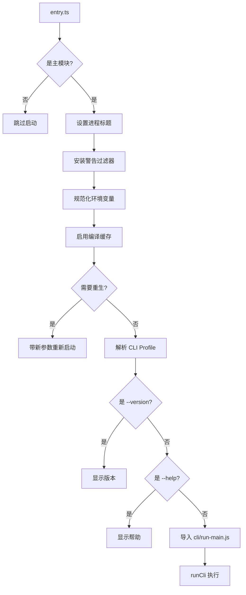

# OpenClaw 源码阅读指南

> 一份帮助你深入理解 OpenClaw 架构和实现的源码导航指南。

## 目录

1. [阅读前准备](#1-阅读前准备)
2. [项目架构概览](#2-项目架构概览)
3. [入口与启动流程](#3-入口与启动流程)
4. [核心模块详解](#4-核心模块详解)
5. [阅读路径推荐](#5-阅读路径推荐)
6. [关键设计模式](#6-关键设计模式)
7. [调试技巧](#7-调试技巧)

---

## 1. 阅读前准备

### 1.1 环境要求

- **Node.js**: 22+
- **TypeScript**: 5.9+
- **IDE**: VSCode（推荐安装 TypeScript 插件）
- **源码工具**: 
  - `ripgrep` (rg) - 快速搜索
  - `tree` - 目录结构查看

### 1.2 快速克隆和安装

```bash
git clone https://github.com/openclaw/openclaw.git
cd openclaw
pnpm install  # 安装依赖
pnpm build    # 构建项目
```

### 1.3 推荐的阅读工具

**VSCode 快捷键**：
- `Cmd/Ctrl + Click` - 跳转到定义
- `F12` - 查看类型实现
- `Shift + F12` - 查找所有引用
- `Cmd/Ctrl + T` - 搜索符号

**命令行工具**：
```bash
# 搜索函数定义
rg "function startGatewayServer" src/

# 查找类型使用
rg "OpenClawConfig" src/ --type ts

# 查看模块依赖
npx madge --image graph.png src/index.ts
```

---

## 2. 项目架构概览

### 2.1 顶层架构

```
┌──────────────────────────────────────────────────────────┐
│                    CLI Entry Point                       │
│              (entry.ts / index.ts)                       │
└─────────────────────┬────────────────────────────────────┘
                      │
                      ▼
┌──────────────────────────────────────────────────────────┐
│                  Gateway Server                          │
│         (src/gateway/server.impl.ts)                     │
│  ┌────────────┐  ┌────────────┐  ┌────────────┐        │
│  │ WebSocket  │  │ HTTP       │  │ Channels   │        │
│  │ Server     │  │ Server     │  │ Manager    │        │
│  └────────────┘  └────────────┘  └────────────┘        │
└─────────────────────┬────────────────────────────────────┘
                      │
      ┌───────────────┼───────────────┐
      │               │               │
      ▼               ▼               ▼
┌──────────┐  ┌──────────┐  ┌──────────┐
│ Telegram │  │ Discord  │  │  Slack   │
│ Channel  │  │ Channel  │  │ Channel  │
└──────────┘  └──────────┘  └──────────┘
      │               │               │
      └───────────────┼───────────────┘
                      ▼
            ┌──────────────────┐
            │  Agent Execution │
            │  (pi-agent-core) │
            └──────────────────┘
                      │
                      ▼
            ┌──────────────────┐
            │  Model Providers │
            │  (OpenAI/Claude) │
            └──────────────────┘
```

### 2.2 目录结构说明

```
src/
├── entry.ts                 # 入口文件（处理启动和环境）
├── index.ts                 # 主模块导出
├── cli/                     # CLI 命令实现
│   ├── program.ts           # Commander.js 程序定义
│   ├── deps.ts              # 依赖注入
│   └── command-*.ts         # 各种 CLI 命令
├── gateway/                 # Gateway 服务层 ⭐核心
│   ├── server.impl.ts       # Gateway 主实现
│   ├── server-methods.ts    # RPC 方法处理
│   ├── server-ws-runtime.ts # WebSocket 运行时
│   ├── server-channels.ts   # Channel 管理
│   ├── server-chat.ts       # Chat 事件处理
│   ├── server-close.ts      # 优雅关闭
│   └── protocol/            # 协议定义
├── agents/                  # Agent 执行层
│   ├── pi-agent-runner.ts   # Agent 运行器
│   ├── pi-embedded-runner/  # 嵌入式运行器
│   ├── tools/               # 工具定义
│   └── skills/              # 技能系统
├── plugins/                 # 插件系统 ⭐核心
│   ├── types.ts             # 插件类型定义
│   ├── loader.ts            # 插件加载器
│   ├── hooks.ts             # Hook 执行器
│   └── runtime/             # 插件运行时
├── channels/                # 消息渠道
│   ├── plugins/             # 内置渠道插件
│   ├── dock.ts              # 渠道接口
│   └── registry.ts          # 渠道注册表
├── telegram/                # Telegram 集成
├── discord/                 # Discord 集成
├── slack/                   # Slack 集成
├── signal/                  # Signal 集成
├── web/                     # WhatsApp Web 集成
├── config/                  # 配置管理
│   ├── config.ts            # 配置加载
│   ├── sessions.ts          # 会话管理
│   └── migrations.js        # 配置迁移
├── infra/                   # 基础设施
│   ├── backoff.ts           # 退避策略
│   ├── retry.ts             # 重试机制
│   ├── tls/                 # TLS 证书管理
│   └── outbound/            # 消息投递
├── process/                 # 进程管理
│   ├── command-queue.ts     # 命令队列
│   ├── supervisor/          # 进程监控
│   └── exec.ts              # 命令执行
├── memory/                  # 记忆系统
├── context-engine/          # 上下文引擎
└── logging/                 # 日志系统
    ├── subsystem.ts         # 分层日志
    └── diagnostic.ts        # 诊断日志
```

---

## 3. 入口与启动流程

### 3.1 入口文件流程图



### 3.2 关键入口文件

#### 📄 `src/entry.ts` - CLI 入口

**职责**：
- 进程标题设置
- 环境变量规范化
- 编译缓存启用
- 警告过滤
- 参数预处理

**关键代码**：

```typescript:src/entry.ts
// 主模块检查
if (isMainModule({ currentFile: fileURLToPath(import.meta.url) })) {
  process.title = "openclaw";
  installProcessWarningFilter();
  normalizeEnv();
  enableCompileCache();  // Node.js 编译缓存
  
  // 重生机制：抑制实验性警告
  if (!ensureExperimentalWarningSuppressed()) {
    // 解析 CLI profile（性能、低内存等）
    const parsed = parseCliProfileArgs(process.argv);
    applyCliProfileEnv({ profile: parsed.profile });
    
    // 运行 CLI
    import("./cli/run-main.js")
      .then(({ runCli }) => runCli(process.argv));
  }
}
```

**阅读提示**：
- 这个文件负责"启动前"的环境准备
- `ensureExperimentalWarningSuppressed()` 是一个重生机制，值得细看
- 跳过警告处理的细节，关注整体流程

#### 📄 `src/index.ts` - 主模块

**职责**：
- 导出公共 API
- 初始化全局状态
- 错误处理设置
- CLI 程序构建

**关键代码**：

```typescript:src/index.ts
// 全局初始化
loadDotEnv({ quiet: true });
normalizeEnv();
enableConsoleCapture();  // 日志捕获
assertSupportedRuntime();  // 运行时检查

// 构建 Commander.js 程序
const program = buildProgram();

// 主模块运行
if (isMain) {
  installUnhandledRejectionHandler();  // 全局错误处理
  
  process.on("uncaughtException", (error) => {
    console.error("[openclaw] Uncaught exception:", formatUncaughtError(error));
    process.exit(1);
  });
  
  // 解析并执行 CLI 命令
  void program.parseAsync(process.argv);
}
```

**阅读提示**：
- 关注全局错误处理机制
- `buildProgram()` 定义了所有 CLI 命令
- 导出的函数是公共 API

---

## 4. 核心模块详解

### 4.1 Gateway 服务层 ⭐⭐⭐⭐⭐

> **最核心的模块**，建议花 60% 的时间理解这里。

#### 📄 `src/gateway/server.impl.ts` - Gateway 主实现

**文件行数**: 1026 行
**复杂度**: ⭐⭐⭐⭐⭐ 极高
**重要性**: ⭐⭐⭐⭐⭐ 必读

**核心函数**: `startGatewayServer(port, opts)`

**职责**：
1. 加载和验证配置
2. 初始化插件系统
3. 创建 HTTP/WebSocket 服务器
4. 启动所有渠道（Telegram、Discord等）
5. 注册 RPC 方法处理器
6. 启动定时任务（cron）
7. 配置热重载
8. 优雅关闭处理

**阅读路径**：

```typescript
// 第1步：配置加载（行 200-300）
let cfgAtStart = await loadConfig();
cfgAtStart = migrateLegacyConfig(cfgAtStart);
cfgAtStart = applyPluginAutoEnable(cfgAtStart);

// 第2步：秘钥激活（行 300-400）
const secretsSnapshot = await prepareSecretsRuntimeSnapshot(...);
activateSecretsRuntimeSnapshot(secretsSnapshot);

// 第3步：插件加载（行 400-500）
const { plugins, channelLogs, ...gatewayMethods } = 
  await loadGatewayPlugins(...);

// 第4步：创建服务器（行 500-600）
const gatewayTls = await loadGatewayTlsRuntime(...);
const { httpServer, wss, clients, broadcast, ... } =
  createGatewayRuntimeState(...);

// 第5步：Channel 管理（行 600-700）
const channelManager = createChannelManager(...);

// 第6步：Hook 系统（行 700-800）
attachGatewayWsHandlers({ ... });

// 第7步：启动（行 800-900）
await runGlobalGatewayStartSafely(...);

// 第8步：优雅关闭（行 900-1026）
const close = createGatewayCloseHandler(...);
return { close };
```

**关键设计点**：

1. **依赖注入模式**
   ```typescript
   // 所有依赖通过参数传递，便于测试
   const channelManager = createChannelManager({
     config,
     log: logChannels,
     channelPlugins,
     runtimeEnv,
     // ... 30+ 个依赖
   });
   ```

2. **延迟初始化（Lazy Initialization）**
   ```typescript
   // 使用 Proxy 延迟加载插件
   const pluginRuntime = createLazyPluginRuntime(() => {
     return actuallyLoadPlugin();
   });
   ```

3. **优雅关闭（Graceful Shutdown）**
   ```typescript
   const close = async (opts) => {
     // 1. 停止接受新连接
     // 2. 等待活动任务完成
     // 3. 关闭所有服务
     // 4. 持久化状态
   };
   ```

**阅读建议**：
- ✅ 先理解整体流程（看注释和函数调用）
- ✅ 关注依赖注入的模式
- ✅ 跳过复杂的错误处理细节
- ⏭️ 第一遍跳过 TLS 和认证相关代码

---

### 4.2 插件系统 ⭐⭐⭐⭐⭐

#### 📄 `src/plugins/types.ts` - 插件类型定义

**重要性**: ⭐⭐⭐⭐⭐ 必读
**难度**: ⭐⭐⭐ 中等

**核心类型**：

```typescript
// 插件定义
export type OpenClawPluginDefinition<
  TName extends string = string,
  TConfig = unknown
> = {
  name: TName;
  version: string;
  config?: TConfig;
  hooks?: {
    [H in keyof PluginHookHandlerMap]?: PluginHookHandlerMap[H];
  };
  tools?: OpenClawPluginToolFactory | OpenClawPluginToolFactory[];
};

// Hook 处理器映射
export type PluginHookHandlerMap = {
  "gateway:start": (ctx: GatewayStartContext) => Promise<void> | void;
  "agent:before": (ctx: AgentContext) => Promise<void> | void;
  // ... 更多 hooks
};
```

**阅读要点**：
- 理解泛型的使用（`TName`、`TConfig`）
- 理解映射类型的 Hook 定义
- 理解判别联合（`PluginConfigValidation`）

#### 📄 `src/plugins/loader.ts` - 插件加载器

**关键函数**: `loadGatewayPlugins()`

```typescript
export async function loadGatewayPlugins(opts: LoadOptions) {
  // 1. 发现插件（从目录、npm 包）
  const discovered = await discoverPlugins();
  
  // 2. 动态加载（使用 jiti）
  for (const pluginPath of discovered) {
    const module = await jiti.import(pluginPath);
    plugins.push(module.default || module);
  }
  
  // 3. 注册 hooks
  for (const plugin of plugins) {
    registerPluginHooks(plugin.hooks);
  }
  
  // 4. 注册 tools
  for (const plugin of plugins) {
    registerPluginTools(plugin.tools);
  }
  
  return { plugins, hooks, tools };
}
```

**设计亮点**：
- 使用 `jiti` 支持 TypeScript 插件直接加载
- 使用 Proxy 实现延迟初始化
- 插件隔离（每个插件有独立的运行时）

#### 📄 `src/plugins/hooks.ts` - Hook 执行器

**关键函数**：

```typescript
// 并行执行（Void Hooks）
export async function runVoidHook<H extends keyof PluginHookHandlerMap>(
  hookName: H,
  context: Parameters<PluginHookHandlerMap[H]>[0]
): Promise<void> {
  const handlers = hookRegistry[hookName] || [];
  
  await Promise.all(
    handlers.map(async (handler) => {
      try {
        await handler(context);
      } catch (error) {
        logHooks.error(`Hook ${hookName} failed:`, error);
      }
    })
  );
}

// 串行执行（Modifying Hooks）
export async function runModifyingHook<T>(
  hookName: string,
  initialValue: T
): Promise<T> {
  let result = initialValue;
  for (const handler of handlers) {
    result = await handler(result);
  }
  return result;
}
```

**阅读要点**：
- 区分 Void Hooks 和 Modifying Hooks
- 理解错误隔离（一个插件失败不影响其他）
- 理解类型安全（`keyof` 约束）

---

### 4.3 Channel 管理 ⭐⭐⭐⭐

#### 📄 `src/gateway/server-channels.ts`

**职责**：
- 启动/停止所有消息渠道
- 健康检查
- 自动重启（带退避）
- 状态监控

**关键代码**：

```typescript
export function createChannelManager(opts) {
  const channels = new Map<ChannelId, ChannelInstance>();
  
  return {
    async start(channelId: ChannelId): Promise<void> {
      const plugin = channelPlugins.get(channelId);
      const instance = await plugin.start({
        config,
        onMessage: handleIncomingMessage,
        onError: (error) => scheduleRestart(channelId, error)
      });
      
      channels.set(channelId, instance);
    },
    
    async stop(channelId: ChannelId): Promise<void> {
      const instance = channels.get(channelId);
      await instance?.stop();
      channels.delete(channelId);
    }
  };
}
```

**设计模式**：
- **策略模式**：每个渠道有不同的实现
- **观察者模式**：渠道事件通知
- **工厂模式**：渠道实例创建

---

### 4.4 Agent 执行层 ⭐⭐⭐⭐

#### 📄 `src/agents/pi-agent-runner.ts`

**职责**：
- 执行 Agent 请求
- 管理上下文
- 流式输出
- 工具调用

**关键流程**：

```typescript
export async function runPiAgent(opts) {
  // 1. 加载上下文
  const context = await loadContext(opts);
  
  // 2. 组装提示词
  const prompt = assemblePrompt(context);
  
  // 3. 调用模型
  const stream = await callModel({
    model: opts.model,
    messages: prompt,
    tools: opts.tools
  });
  
  // 4. 处理流式输出
  for await (const chunk of stream) {
    if (chunk.type === "text") {
      yield { type: "text", content: chunk.text };
    } else if (chunk.type === "tool_call") {
      const result = await executeTool(chunk.tool, chunk.args);
      yield { type: "tool_result", result };
    }
  }
}
```

**阅读要点**：
- 理解流式处理（AsyncIterator）
- 理解工具调用机制
- 理解上下文组装

---

### 4.5 配置系统 ⭐⭐⭐

#### 📄 `src/config/config.ts`

**职责**：
- 配置文件加载（JSON5）
- 配置验证
- 配置迁移
- 热重载

**关键函数**：

```typescript
export function loadConfig(): OpenClawConfig {
  // 1. 读取配置文件
  const raw = readConfigFileSnapshot(CONFIG_PATH);
  
  // 2. 解析 JSON5
  const parsed = JSON5.parse(raw);
  
  // 3. 迁移旧版配置
  const migrated = migrateLegacyConfig(parsed);
  
  // 4. 验证配置
  validateConfig(migrated);
  
  return migrated;
}
```

#### 📄 `src/gateway/config-reload.ts` - 热重载

```typescript
export function startGatewayConfigReloader(opts) {
  // 监听配置文件变化
  const watcher = fs.watch(CONFIG_PATH, async (event) => {
    if (event === "change") {
      const newConfig = loadConfig();
      
      // 触发重载 hooks
      await runConfigReloadHooks({ newConfig, oldConfig });
      
      // 更新全局配置
      updateGlobalConfig(newConfig);
    }
  });
  
  return { stop: () => watcher.close() };
}
```

---

## 5. 阅读路径推荐

### 5.1 初学者路径（第1周）

**目标**：理解整体架构和数据流

**Day 1-2: 入口和 CLI**
1. `src/entry.ts` - 入口文件
2. `src/index.ts` - 主模块
3. `src/cli/program.ts` - CLI 命令定义
4. `src/cli/deps.ts` - 依赖注入

**Day 3-4: Gateway 概览**
1. `src/gateway/server.impl.ts` - 只看主流程，跳过细节
2. `src/gateway/server-methods-list.ts` - RPC 方法列表
3. `src/gateway/protocol/schema/types.ts` - 协议类型

**Day 5-7: 插件系统**
1. `src/plugins/types.ts` - 插件类型
2. `src/plugins/loader.ts` - 插件加载
3. `src/plugins/hooks.ts` - Hook 执行
4. `extensions/` - 看一个实际插件示例

### 5.2 进阶路径（第2周）

**目标**：深入核心模块实现

**Day 1-2: Gateway 深入**
1. `src/gateway/server-ws-runtime.ts` - WebSocket 运行时
2. `src/gateway/server-channels.ts` - Channel 管理
3. `src/gateway/server-chat.ts` - Chat 事件处理
4. `src/gateway/auth.ts` - 认证系统

**Day 3-4: 并发控制**
1. `src/process/command-queue.ts` - 命令队列
2. `src/plugin-sdk/keyed-async-queue.ts` - 键控队列
3. `src/infra/outbound/delivery-queue.ts` - 持久化队列
4. `src/gateway/auth-rate-limit.ts` - 限流

**Day 5-7: Agent 执行**
1. `src/agents/pi-agent-runner.ts` - Agent 运行器
2. `src/agents/tools/` - 工具系统
3. `src/agents/skills/` - 技能系统
4. `src/context-engine/` - 上下文引擎

### 5.3 专家路径（第3周+）

**目标**：掌握所有细节，能够贡献代码

**网络通信**
1. `src/gateway/server/ws-connection.ts` - WebSocket 连接
2. `src/gateway/server-broadcast.ts` - 广播机制
3. `src/infra/tls/gateway.ts` - TLS 证书

**错误处理和重试**
1. `src/infra/retry.ts` - 重试机制
2. `src/infra/backoff.ts` - 退避策略
3. `src/gateway/server-close.ts` - 优雅关闭

**渠道集成**
1. `src/telegram/` - Telegram 完整实现
2. `src/discord/` - Discord 集成
3. `src/channels/dock.ts` - 渠道抽象接口

---

## 6. 关键设计模式

### 6.1 依赖注入

**位置**: 几乎所有模块

**示例**:
```typescript
// 不使用全局变量，所有依赖通过参数传递
function createChannelManager(opts: {
  config: OpenClawConfig;
  log: Logger;
  channelPlugins: Map<string, ChannelPlugin>;
  // ... 更多依赖
}) {
  // 使用 opts.* 访问依赖
}
```

**优点**:
- 易于测试（可以注入 mock）
- 依赖关系清晰
- 避免隐式依赖

### 6.2 工厂模式

**位置**: `src/context-engine/registry.ts`

**示例**:
```typescript
const contextEngineRegistry = new Map<string, ContextEngineFactory>();

export function createContextEngine(type: string, config: unknown) {
  const factory = contextEngineRegistry.get(type);
  if (!factory) throw new Error(`Unknown engine: ${type}`);
  return factory(config);
}
```

### 6.3 策略模式

**位置**: `src/infra/backoff.ts`

**示例**:
```typescript
type BackoffPolicy = "none" | "linear" | "exponential" | "fibonacci";

export function computeBackoff(
  attempt: number,
  policy: BackoffPolicy
): number {
  switch (policy) {
    case "exponential":
      return baseDelay * Math.pow(2, attempt - 1);
    // ... 其他策略
  }
}
```

### 6.4 观察者模式

**位置**: `src/gateway/server-broadcast.ts`

**示例**:
```typescript
const subscribers = new Set<WebSocket>();

function broadcast(message: unknown): void {
  for (const ws of subscribers) {
    ws.send(JSON.stringify(message));
  }
}
```

### 6.5 代理模式（Proxy）

**位置**: `src/plugins/loader.ts`

**示例**:
```typescript
function createLazyPlugin<T>(loader: () => T): T {
  let instance: T | null = null;
  
  return new Proxy({} as T, {
    get(target, prop) {
      if (!instance) {
        instance = loader();  // 延迟加载
      }
      return instance[prop as keyof T];
    }
  });
}
```

---

## 7. 调试技巧

### 7.1 日志系统

OpenClaw 使用分层日志系统：

```typescript
import { createSubsystemLogger } from "./logging/subsystem.js";

const log = createSubsystemLogger("my-module");
log.info("Something happened");
log.error("Error occurred", error);
```

**查看日志**:
```bash
# macOS: 使用 unified logging
sudo log stream --predicate 'subsystem == "ai.openclaw"' --level debug

# 或使用 scripts/clawlog.sh
./scripts/clawlog.sh --follow
```

### 7.2 断点调试

**VSCode 配置** (`.vscode/launch.json`):
```json
{
  "type": "node",
  "request": "launch",
  "name": "Debug OpenClaw",
  "program": "${workspaceFolder}/dist/entry.js",
  "args": ["gateway", "run"],
  "console": "integratedTerminal"
}
```

### 7.3 常用调试命令

```bash
# 查看 Gateway 状态
openclaw channels status --deep

# 查看配置
openclaw config get

# 查看插件列表
openclaw plugins list

# 查看网络连接
ss -ltnp | grep 18789

# 查看进程
ps aux | grep openclaw
```

### 7.4 源码搜索技巧

```bash
# 查找函数定义
rg "^export function startGatewayServer" src/

# 查找类型使用
rg "OpenClawConfig" src/ --type ts

# 查找所有 Hook 定义
rg '"gateway:start"|"agent:before"' src/

# 查找错误处理
rg "catch.*error" src/ -A 3

# 查找 TODO 注释
rg "TODO|FIXME" src/
```

### 7.5 性能分析

```bash
# Node.js 性能分析
node --prof dist/entry.js gateway run

# 处理性能日志
node --prof-process isolate-*.log > profile.txt

# 内存快照
node --inspect dist/entry.js gateway run
# 然后在 Chrome DevTools 中连接
```

---

## 附录

### A. 重要文件清单

| 文件 | 重要性 | 难度 | 行数 | 说明 |
|------|--------|------|------|------|
| `src/entry.ts` | ⭐⭐⭐⭐ | ⭐⭐ | 193 | 入口文件 |
| `src/gateway/server.impl.ts` | ⭐⭐⭐⭐⭐ | ⭐⭐⭐⭐⭐ | 1026 | Gateway 核心 |
| `src/plugins/types.ts` | ⭐⭐⭐⭐⭐ | ⭐⭐⭐ | 887 | 插件类型 |
| `src/plugins/loader.ts` | ⭐⭐⭐⭐ | ⭐⭐⭐ | ~300 | 插件加载 |
| `src/plugins/hooks.ts` | ⭐⭐⭐⭐ | ⭐⭐⭐ | ~200 | Hook 执行 |
| `src/gateway/server-channels.ts` | ⭐⭐⭐⭐ | ⭐⭐⭐⭐ | ~400 | Channel 管理 |
| `src/process/command-queue.ts` | ⭐⭐⭐⭐ | ⭐⭐⭐⭐ | ~500 | 命令队列 |
| `src/config/config.ts` | ⭐⭐⭐ | ⭐⭐ | ~800 | 配置系统 |

### B. 学习资源

**官方文档**:
- [OpenClaw 文档](https://docs.openclaw.ai/)
- [VISION.md](../VISION.md) - 项目愿景
- [SECURITY.md](../SECURITY.md) - 安全模型

**相关项目**:
- [pi-agent-core](https://github.com/mariozechner/pi-agent-core) - Agent 核心
- [TypeBox](https://github.com/sinclairzx81/typebox) - Schema 验证

**推荐书籍**:
- 《设计模式：可复用面向对象软件的基础》
- 《Node.js 设计模式》
- 《Effective TypeScript》

---

**祝你阅读愉快！如有问题，欢迎在 GitHub Issues 中提问。**
